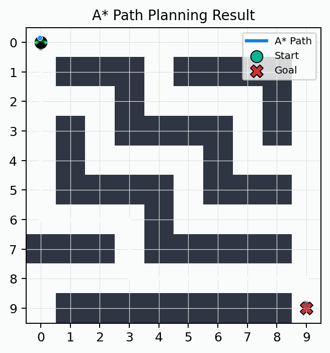
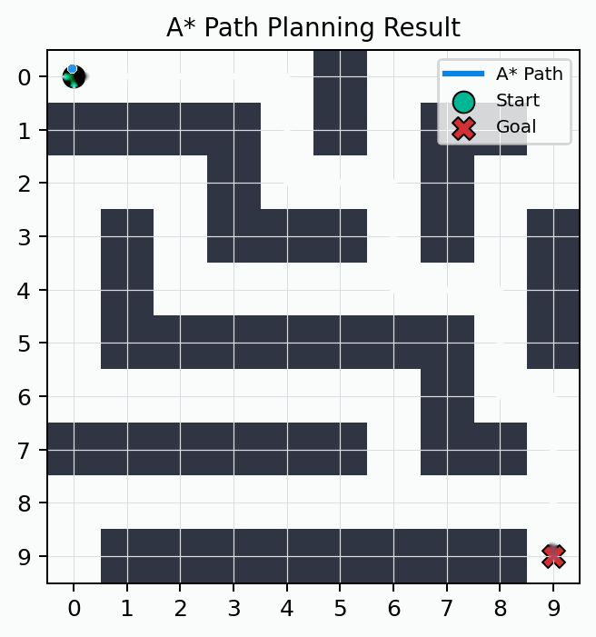
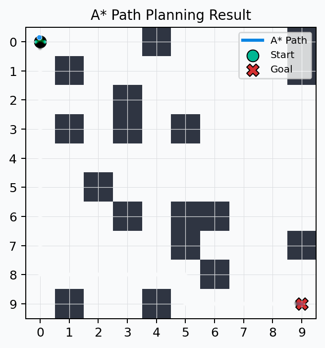

<div align="center">

# 🤖 Robot Path Planning with A* Algorithm

### 基于 A* 算法的二维栅格地图路径规划系统


</div>

---

## 📌 Project Overview | 项目简介

本项目实现了一个基于 **A* Search Algorithm** 的二维栅格地图路径规划系统。

项目使用 CSV 文件表示二维栅格地图，其中 `0` 表示可通行区域，`1` 表示障碍物。程序能够自动读取地图数据，基于 A* 算法搜索从起点到终点的可行路径，并使用 Matplotlib 将路径规划结果可视化保存为图片。

该项目面向机器人路径规划、无人系统基础算法、栅格地图搜索等方向，是一个从算法理解到代码实现的入门型工程项目。

---

## ✨ Highlights | 项目亮点

- 实现 A* 路径规划算法核心流程
- 支持从 CSV 文件读取二维栅格地图
- 支持障碍物判断与四邻域节点搜索
- 实现路径回溯，输出完整路径坐标
- 支持路径规划结果可视化
- 项目结构清晰，便于后续扩展 Dijkstra、动态障碍物、GIF 动画等功能

---

## 🎬 Path Search Animation | 路径搜索动图演示

<table>
  <tr>
    <td align="center"><b>Map 1</b></td>
    <td align="center"><b>Map 2</b></td>
    <td align="center"><b>Random Map</b></td>
  </tr>
  <tr>
    <td align="center">
      
    </td>
    <td align="center">
      
    </td>
    <td align="center">
      
    </td>
  </tr>
</table>

图中：

- `Start` 表示起点
- `Goal` 表示终点
- 蓝色路径表示 A* 算法搜索得到的可行路径
- 路径会自动绕开障碍物区域

---

## 🗂️ Project Structure | 项目结构

```text
robot-path-planning/
│
├── maps/
│   ├── map1.csv              # 固定测试地图
│   ├── map2.csv              # 备用地图
│   └── random_map.csv        # 随机生成地图
│
├── outputs/
│   └── map1_astar.png        # A* 路径规划可视化结果
│
├── src/
│   ├── astar.py              # A* 主算法实现
│   ├── generate_map.py       # 随机地图生成器
│   ├── map_loader.py         # 地图读取与邻居节点搜索
│   └── visualize.py          # 路径可视化模块
│
├── README.md
├── requirements.txt
└── .gitignore
```

---

## 🧩 Map Representation | 地图表示方式

本项目使用 CSV 文件表示二维栅格地图：

```text
0 = 可通行区域
1 = 障碍物
```

示例地图：

```text
0,0,0,0,0
1,1,1,1,0
0,0,0,0,0
0,1,1,1,1
0,0,0,0,0
```

程序会将 CSV 地图读取为 NumPy 二维数组，并用于后续路径搜索。

---

## 🧠 Algorithm Principle | 算法原理

A* 算法通过综合考虑已经走过的实际距离与到终点的估计距离，选择最有希望到达终点的节点继续扩展。

核心评价函数为：

```text
f(n) = g(n) + h(n)
```

其中：

- `g(n)`：从起点到当前节点的实际代价
- `h(n)`：从当前节点到终点的启发式估计代价
- `f(n)`：当前节点的综合评价分数

本项目采用 **Manhattan Distance 曼哈顿距离** 作为启发式函数：

```text
h(n) = |x1 - x2| + |y1 - y2|
```

该启发式函数适用于只能进行上下左右移动的二维栅格地图。

---

## 🔁 Core Workflow | 核心流程

A* 搜索过程主要包括：

```text
1. 将起点加入 open_set
2. 从 open_set 中选择 f_score 最小的节点作为 current
3. 判断 current 是否为终点
4. 若不是终点，则扩展 current 周围可通行的邻居节点
5. 更新 came_from、g_score 和 f_score
6. 将新的候选节点加入 open_set
7. 重复搜索，直到找到终点或无路可走
8. 根据 came_from 回溯完整路径
```

---

## 🚀 How to Run | 如何运行

### 1. 克隆项目

```bash
git clone https://github.com/telitor/robot-path-planning.git
cd robot-path-planning
```

### 2. 创建虚拟环境

Windows PowerShell：

```bash
python -m venv venv
venv\Scripts\activate
```

### 3. 安装依赖

```bash
pip install -r requirements.txt
```

### 4. 运行 A* 路径规划

```bash
python src/astar.py
```

运行成功后，路径规划结果会保存到：

```text
outputs/map1_astar.png
```

---

## ✅ Features Implemented | 已实现功能

- [x] CSV 栅格地图读取
- [x] 障碍物判断
- [x] 四邻域节点搜索
- [x] 曼哈顿距离启发式函数
- [x] A* 主循环
- [x] 路径回溯
- [x] 路径可视化
- [x] PNG 结果图保存
- [x] GitHub 项目结构整理


---

## 🎯 Project Significance | 项目意义

本项目不仅实现了 A* 算法的基础功能，也初步体现了一个完整算法工程项目应具备的结构：

```text
数据输入 → 算法计算 → 路径回溯 → 可视化输出 → GitHub 展示
```

通过该项目，可以进一步理解路径规划算法在移动机器人、无人系统、自动驾驶与智能体导航等方向中的基础作用。

---

## 👤 Author

Created by **telitor**

This project is part of my learning process in robotics path planning, algorithm implementation, and applied artificial intelligence.
